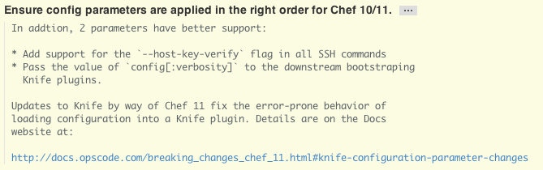

RNL Style Guide
================================================================================

To get started, visit [GitHubs's Style Guide](https://github.com/styleguide/) and read the Overview in
each section.

General
--------------------------------------------------------------------------------
* Use soft tabs (spaces instead of tab characters)
* 

CSS
--------------------------------------------------------------------------------


Ruby
--------------------------------------------------------------------------------
* [GitHub Ruby Style Guide](https://github.com/styleguide/ruby)

PHP
--------------------------------------------------------------------------------


Javascript
--------------------------------------------------------------------------------


Git
--------------------------------------------------------------------------------
* Structure your commit message like this:

    ```
    One line summary (less than 50 characters)

    Longer description (wrap at 72 characters)
    ```
    * Example of a commit that is too long:
        
    * Example of a good commit:
        
* Commit summary:
    * Less than 50 characters
    * What was changed
    * Write in imperative present tense (fix, add, change): (`Fix bug 123.`, `Add 'foobar' command.`, `Change default timeout to 60 seconds.`).
      Ask yourself this question: “What will applying the patch do?”
      and you answer with “it will **remove utils.wrapMethod.**”.
      Also it’s
      [official git style](http://repo.or.cz/w/git.git?a=blob;f=Documentation/SubmittingPatches;hb=HEAD)
    * Use good grammar, capitalization, etc
* Commit description:
    * Wrap at 72 characters
    * Why, explain intention and implementation approach
    * Present tense
* Commit atomicity:
    * Break up logical changes - this is Git after all! Make effective use of
        the staging area to accomplish this.