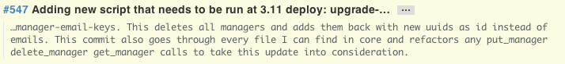
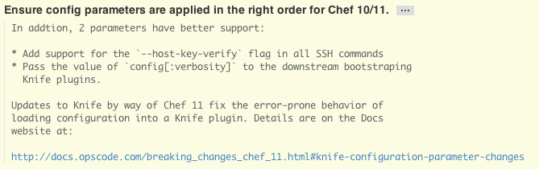

Coding Style Guide
================================================================================

To get started, visit [GitHub's Style Guide](https://github.com/styleguide/) and read the Overview in each section.

Conformity to this guide is really just to help us all get along and keep things consistent-looking. To that end, many of the decisions are arbitrary, because *someone* had to pick a number of spaces for us all to stick with.

General - all languages
--------------------------------------------------------------------------------
#### Do
* Use soft tabs (spaces instead of tab characters) - set your editor up for this
* Make liberal use of your editor's reformat command to keep
    whitespace consistent throughout a document, but take care that it doesn't bork
    the formatting of array initializers and the like.
* Try to be specific when naming things. Something long and descriptive is better than something short and ambiguous - be nice to the future you. Name variables, methods, and classes to reveal intent.
* Start your function names with verbs, it will help you conceptualize what's going on.
* Try to use `CamelCase` for class names, `snake_case` for variables and functions unless there's a really strong language/framework reason for something else. This is simply so that we don't have to think about it when we're switching between languages.
* Write braces (if your languages supports them) in the [One True Brace Style](http://en.wikipedia.org/wiki/Indent_style#Variant:_1TBS):

    ```
    if (x < 0) {
        puts("Negative");
        negative(x);
    } else {
        puts("Non-negative");
        nonnegative(x);
    }
    ```
* Avoid inline comments.
* Delete trailing whitespace.
* Keep hash/array elements on their own lines and closing curly brace on its own line.
* Make liberal use of whitespace to organize your code into logical areas.
* Avoid abbreviations.
* Avoid types in names (`user_array`).
* Treat acronyms as words in names (`XmlHttpRequest` not `XMLHTTPRequest`), even if the acronym is the entire name (`class Html` not `class HTML`).

#### Don't
* Include spaces after `(`, `[` or before `]`, `)` unless it's for a control structure.
* Break up an argument list on multiple lines.


CSS
--------------------------------------------------------------------------------
* [GitHub CSS Style Guide](https://github.com/styleguide/css)
* Two spaces soft indentation
* Use lowercase hex colors (e.g. `#fff`) instead of color names (e.g. `white`).
* Use hyphens between class names like `ui-button-content`, rather than `uiButtonContent` or `ui_button_content`.
* Try to avoid inline styling wherever you can.

Ruby
--------------------------------------------------------------------------------
* [GitHub Ruby Style Guide](https://github.com/styleguide/ruby)

PHP
--------------------------------------------------------------------------------
* Four spaces soft indentation
* If using [Caret](https://github.com/rednovalabs/caret):
    * Use the `inputTag()` method to generate form inputs rather than hand-building
        them. See [caret/pages/helpers/forms.php](https://github.com/rednovalabs/caret/blob/master/pages/helpers/forms.php)

Javascript
--------------------------------------------------------------------------------
* Four spaces soft indentation

HTML
--------------------------------------------------------------------------------
* [GitHub HTML Style Guide](https://github.com/styleguide/templates)
* Four spaces soft indentation

Git
--------------------------------------------------------------------------------
* Structure your commit message like this:
 
    ```
    One line summary (less than 50 characters)

    Longer description (wrap at 72 characters)
    ```
    * Example of a commit that is too long:
        
    * Example of a good commit:
        
* Commit summary:
    * Less than 50 characters
    * What was changed
    * Write in imperative present tense (fix, add, change): (`Fix bug 123.`, `Add 'foobar' command.`, `Change default timeout to 60 seconds.`).
      Ask yourself this question: “What will applying the patch do?”
      and you answer with “it will **remove utils.wrapMethod.**”.
      Also it’s
      [official git style](http://repo.or.cz/w/git.git?a=blob;f=Documentation/SubmittingPatches;hb=HEAD)
    * Use good grammar, capitalization, etc
* Commit description:
    * Wrap at 72 characters
    * Why, explain intention and implementation approach
    * Present tense
* Commit atomicity:
    * Break up logical changes - this is Git after all! Make effective use of
        the staging area to accomplish this.